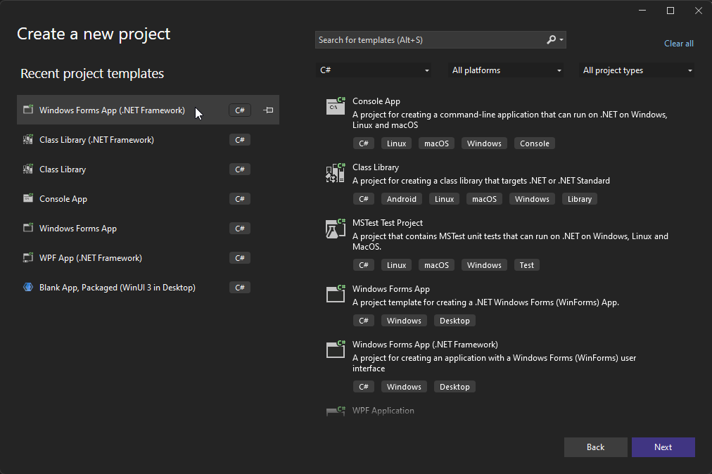
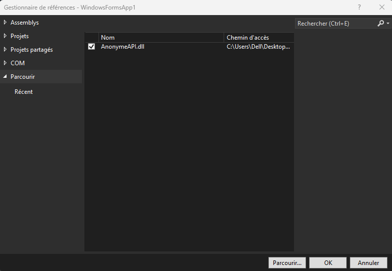

## this project is still in beta [Join Discord](https://discord.gg/CegsDrZR5W)


# Anonyme-API

> ### ⚠️ This project are for educational purposes only, if you do use this on Roblox and you can get banned, that is your fault as you are breaking their Terms of Service.

## Getting started

1. Create A visual Studio project ( WPF APP or .NET FRAMEWORK )


2. Download Api from [here](https://cdn.discordapp.com/attachments/978018060604686428/1251486331742322718/AnonymeAPI.dll?ex=666ec0f8&is=666d6f78&hm=65a777105db0b6a6bd16243041b2562d23dc5538a8a3e6feaa67953f680752d7&)

3. Add to reference


4. Go into ur script of form And the on top Enter
```cs
using AnonymeAPI;
```

## And now apî is in your project

# Execute

```cs
AnonymeAPI.ByfronUser.Execute(ur script);
```
Remplace Ur Script to ur richtextbox or other thinks

# Connect to Solara

```cs
AnonymeAPI.ByfronUser.Connect();
```

# Kill Roblox

```cs
AnonymeAPI.Client.killroblox();
```

# Execute IY

```cs
AnonymeAPI.functions.Scripts.iy();
```

> ### ⚠️ This is Still in beta And make sure to have Solara in ur debug folder !
